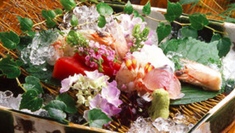



カフェでノマドはもう古い！？ 新しい時代の幕開け、寺ハッカソンが福井で行われます。

**日程は 6/22 〜 6/23 。１泊２日のコースです。**

でも、なぜ今「寺」で「ハッカソン」なのか？ 今回はこの記事で寺ハッカソンの魅力を余すことなく伝えたいと思います。

## 1. メシが豪華すぎてヤバイ

精進料理だと思ったそこのあなた、違うんです。

**[萬谷さんという料亭](http://www.mantani.jp/contents/mantani/index.html)のご飯なのです！**

１泊２日、料亭の食事付き。そんなの普通のハッカソンでありえます？

## 2. 観光もできちゃう！　県外からの方もぜひ

[当日のスケジュール](http://www.fisc.jp/ugf_detail.php?eid=00039)を抜粋しますと、

- 16:30〜 集合、まちなか観光
- 17:30〜 夕食
- 19:30〜 講座
- 20:00〜 アイデア出し、発表

~~あれ、これほとんど観光じゃね？~~ **20:00 からのアイデア出しを万全な状態で迎えられますね！**

***

本当に 108 個あげると長すぎるので飛ばします。

***

## 107. とてもお手軽に参加できる。泊まらなくても OK!

とても気軽に参加できるハッカソンです。宿泊プランもありますが、**泊まらなくても構いません！** 土曜、日曜のどちらでも、都合のいい方に来ていただければ OK です。

さらに、持ち物は PC 一つあれば OK。一般的な開発者は、常に手元にノートパソコンがあることでしょう。持ち物はそのパソコンだけで構いません。飲み物なども用意されています。

いつものあなたのスタイルそのままで参加出来ます。**そう、寺ハッカソンならね。**

## 108. 雑念０の超集中できる環境

お寺で雑念が生まれるわけないですよね。カフェでノマドとか、一人強烈な個性の客とかが来たらもう集中できないです。開発に必要なものはなんですか？

そう、**Wi-Fi と PC です。**

お寺はもちろん** Wi-Fi 完備**。しかし、余計な雑念はない。あるのは、他所にはない**ストイックさ**だけです。

寺で、ハッカソン。**伝統と近未来のコラボレーション**がここにあります。

もう一度。**日程は 6/22 〜 6/23 。１泊２日のコースです。**

ぜひふるってご参加ください！

参加はこちらから→ <http://www.fisc.jp/ugf_detail.php?eid=00039>