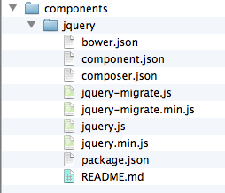
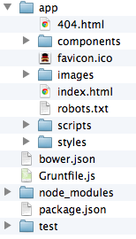

<script type="text/javascript" src="js/knockout-latest.js"></script>

# Big Wave Node
<!-- id: title -->

## 自己紹介
- 山越崇裕と申します
- jig.jp という会社から来ました
- イカちゃんとかコッシーとか呼ばれてます

## 普段の仕事
- hottoLINE, COPAIN といったチャットアプリの裏側作りました
- Pairin というアプリの HTML 部分を担当

## 社外では
- JAWS UG 勉強会
- Mashup Award 8 で企業賞
- その他、ハッカソン出現率高し

## なぜ WCAF に<br>呼ばれたのか
- node 初期の頃、いろいろ作ってた
 - twitter のタイムラインをリアルタイムマッピング
 - ハッシュタグ監視ツール

多分、JS の話を期待されてる！

## カミングアウト
<!-- data-rotate: '+90' -->

### 最近 JS 触ってません

- １年くらいサーバオンリー
 - Pairin が１年前
- すいません

# 久々に JS

## 復帰早々気づいたこと

**node ってすげえな**

## やたら目にする<br>ブログ記事

- フロントエンドエンジニアにおけるNode.jsのススメ
 - <http://ameblo.jp/ca-1pixel/entry-11476850674.html>

## やたら目にする npm

- npm install bower -g
- npm install grunt-cli -g
- npm! npm!

## なんでだろう？

考えてみた

### インストールしやすい
- mac なら pkg
- windows なら exe
- linux なら rpm

それぞれ公式が配布！

### 作ったものを配布しやすい
- node と一緒に npm が入る
- npm install tool でツールをゲット！

node の導入も楽なら、その後のツールの導入も楽

### frontend エンジニアの発想

普段バリバリの JSer が不満を抱いて node でツールを作る

## のるしかない
<!-- data-x: '+0' -->
<!-- data-y: '+0' -->
<!-- data-z: '+3000' -->
<!-- class: ride-on -->

このビックウェーブに

## いつのるの？
<!-- data-x: '+0' -->
<!-- data-y: '+0' -->
<!-- data-z: '+3000' -->
<!-- class: ride-on -->

いｍ（ｒｙ

## WCAF vol.10 で<br>俺は成長するんだ！

流行りのものや定番をいろいろ勉強

俺はやるぞ！

## web サービスを<br>作ってみた

<https://moorchat.nodejitsu.com>

# おことわり

## プログラマー・ハイ

web サービスをゴリゴリ作る<br>↓

テンションが上がる<br>↓

かなりプログラマー向けな話題に

## セッションの聞き方

1. ( ´_ゝ｀)ﾌｰﾝって感じで流す
1. ツール名だけでも覚える
1. さっきのサービスでJSといちゃいちゃする
1. うっひょー俺もコーディングしちゃうぜ

# 本題
<!-- data-rotate: '+90' -->

## やりたいこと
- 最新技術や定番を勉強したい
- シングルページアプリ作りたい
- リアルタイムなの作りたい

## それぞれへの対応
- 最新技術や定番を勉強したい
 - yeoman, bower, grunt, RequreJS, scss with compass
- シングルページアプリ作りたい
 - knockoutjs, sammyjs
- リアルタイムなの作りたい
 - socket.io

## 今回紹介するもの

- node 製のツール
 - bower, grunt, yeoman
- frontend ライブラリ
 - knockout.js

# node 製のツール
<!-- data-rotate: '-90' -->

# yeoman

[](http://yeoman.io/)

- grunt, bower と連携し RequireJS, scss with compass, coffeescript などのひな形を作成するツール
- **最新技術や定番を追う**にピッタリ

## あとまわし

- bower, grunt を先に説明します

# bower
<!-- data-rotate: '+90' -->

[](http://bower.io/)

## A package manager<br>for the web

- フロントエンド版 npm
- npm はあくまで node 用のライブラリを取ってくるもの
- bower は例えば jquery だったりをコマンド一発で取ってくるもの

## 使い方

- 黒い画面を開いて
- npm install -g bower
- bower -v でバージョン番号が出れば OK

## bower コマンド

- bower install
- bower search
- bower init
 - とても npm ライク

### bower search

```
$ bower search jquery  # search => s でも OK

jquery git://github.com/components/jquery.git
jquery-ui git://github.com/components/jqueryui
jquery.cookie git://github.com/carhartl/jquery-cookie.git
jquery-placeholder git://github.com/mathiasbynens/jquery-placeholder.git
...
```

### bower install

```
$ bower install jquery  # install => i でも OK

bower cloning git://github.com/components/jquery.git
bower cached git://github.com/components/jquery.git
bower fetching jquery
bower checking out jquery#2.0.0
bower copying /Users/..a260ac7c3997f4381
bower installing jquery#2.0.0
```

### どこにインストールされた？



```
<script src="components/jquery/jquery.min.js"></script>
```

### 一歩進んで

依存関係の解決

```
<script src="components/jquery/jquery.min.js"></script>
```

- これが書かれたHTMLは、jQuery に依存している
 - jQuery がないと表示できない

### bower.json
<!-- class: code-small -->

bower init と叩くと、bower.json というファイルが作られる

```
{
  "name": "myapp",
  "version": "0.0.0",
  "dependencies": {
    "jquery": "~2.0.0"
  },
  "ignore": [
    "**/.*",
    "node_modules",
    "components"
  ]
}
```

### bower.json
<!-- class: code-big -->

```
  "dependencies": {
    "jquery": "~2.0.0"
  },
```

dependencies : 依存

### bower install

```
$ bower install
bower cloning git://github.com/components/jquery.git
...
bower installing jquery#2.0.0
```

bower.json に書かれたとおりにライブラリをインストール

### bower.json だけ管理すればOK

昔: この html を表示するにはこれとこれとこれが必要だから全部zipでまとめておきましたテヘペロ

今: bower 入ってる？　なら bower install と叩けば OK だよ！

### これ豆な

- bower install jquery --save
 - bower.json に追記してくれる

### bower まとめ

まずはjqueryとかダウンロードするツールとして使ってみてください

その後、bower.json なんかに慣れていくと幸せになれると思います

## GRUNT
<!-- data-rotate: '+90' -->


### The JavaScript Task Runner

単純作業(タスク)を JS で自動化

例）このファイルを削除してから、このファイルをコピーしてきてね

bat ファイルとかに近い

### タスクの実行

grunt {タスク名} で実行

grunt hoge

### タスクを作る

hoge というタスクを作る場合

```
grunt.registerTask('hoge', function (target) { ... });
```

作る方は時間がないので省略

### yeoman のひな形では……

- grunt build
 - js を自動で 1 ファイルにくっつけて minify とか、配布用の準備
 - RequireJS との連携も
- grunt test
 - テストコード実行
- **grunt server**
 - これがアツイ

### grunt server (demo)
- ローカルサーバを立て、そのページを自動で開く
 - http://localhost:9000
- ファイルの変更を監視
 - coffee が変われば js 生成
 - scss が変われば css 生成
 - 自動でブラウザリロード

### grunt まとめ

深く掘り下げにくい……時間ない

使いこなせば必ずあなたの目的にフィットするツールになるはず

grunt 勉強会とかやりたい

# 最後に yeoman

[](http://yeoman.io/)

## 使い方
- npm install yo -g
 - grunt, bower, compass は自分でインストールする必要がある

## yo webapp
<!-- class: small-img -->



ひな形が作られる

## ひな形の概要

- bower.json で bootstrap, jquery のセットアップ
- grunt 用の各種タスクが書かれた設定ファイル生成
- ディレクトリ構成をきれいに

## yeoman いいところ
- 各ツールの設定ファイル生成
 - grunt, bower, RequireJS などは設定ファイルを書くのが結構手間
 - ディレクトリ構成考えるのも一苦労
 - ひな形眺めるだけでも参考になる

## yeoman 難点
- scss が必須
 - こいつだけ ruby 製、 less の方が敷居は下がりそう
- あくまで、ひな形
 - grunt, bower, scss, RequireJS などへの理解が求められる

# frontend<br>ライブラリ
<!-- data-rotate: '-90' -->

# knockout.js


## MVVM フレームワーク

え、難しそう、、

## 大丈夫
<!-- data-x: '+0' -->
<!-- data-y: '+0' -->
<!-- data-z: '+1000' -->

## 例えばこんなフォーム

<div style="background-color: white">
  <p>WCAF まんじゅう!!
    <span data-bind="text: kakaku"></span>円
  </p>
  <p>注文数:
    <input type="text"
           data-bind="value: kazu, valueUpdate: 'afterkeydown'"/>
  </p>
  <p>
    <span data-bind="text: kakaku() * kazu()"></span>
    円になります
  </p>
</div>
<script>
var manjuViewModel = {
  kakaku: ko.observable(500),
  kazu: ko.observable(0)
};
ko.applyBindings(manjuViewModel);
</script>

## こう書けます(HTML)

```
<p>WCAF まんじゅう!!
  <span data-bind="text: kakaku"></span>円
</p>
<p>注文数:
  <input type="text"
         data-bind="value: kazu, 
                    valueUpdate: 'afterkeydown'"/>
</p>
<p>
  <span data-bind="text: kakaku() * kazu()"></span>
  円になります
</p>
```

## こう書けます(JS)
<!-- class: code-big -->

```
var manjuViewModel = {
  kakaku: ko.observable(500),
  kazu: ko.observable(0)
};
ko.applyBindings(manjuViewModel);
```

## What's MVVM?

- M: モデル
- V: ビュー
- VM: ビューモデル

## What's MVVM?

- M: まんじゅうの値段や個数
- V: HTML
- VM: まんじゅうとHTMLをつなぐ
 - まんじゅうの値段をこことここに書いてね
 - まんじゅうの個数はこのフォームと連動してね

## なにがうれしい？

- まんじゅうの値段を10,000円にしたい
 - M を変えればいい
- 売ってるサイトの見た目を変えたい
 - V を変えればいい

分かれてるので変更が用意

## knockout まとめ

- MVC, MVVM フレームワーク色々
 - backbone, angular などなど
- knockoutjs は一番シンプル（だと思う）
 - ピンポイントな用途でも使える

# その他<br>(サーバとか)

さらっと流します；

## express
- サーバを簡単にかけます（適当）
- ruby できる人は node 界の sinatra で通じる

## node-dev
- node のコードを監視して自動リロード
- grunt server の動きを express とかのサーバでも簡単に実現するコマンド

## socket.io
- websocket, xhr-polling, jsonp と様々な手段でリアルタイム通信を実現してくれる。
- クライアントがブラウザの場合、これを使わない理由があんまりない。
 - ブラウザ間の互換がすごい

### これ豆な
- require.js の wrap を false にしないとうまく動かない
- <https://groups.google.com/forum/#!msg/requirejs/irKdpw3Gfqg/TL7SL7v7Er0J>

# そして<br>月日は流れ

## ムーアチャット爆誕

### まとめ

最新技術を使うのは労力がいる

でもブラウザが自動リロードした時など心がおどる

私はサービス開発が好きだ

# 最後に

今回のスライドについて

# impress.js

html + js でできたプレゼンツール

## WCAF で<br>あるまじき発言
- html 書くのだるいな
- 箇条書きでもかっこよくできねぇかな
- markdown から自動生成したいよね

## perl 製のがあった

[markdown2impress](https://github.com/yoshiki/markdown2impress)

でもちょっと弄りたいな……

## node で作っちゃった☆
- node-markdown2impress
 - 参考（perl）

## これが、
```
### こうなります
- ドヤァ
- ドヤァ
- ドヤァ
```

## こうなります
- ドヤァ
- ドヤァ
- ドヤァ

## あえて言おう

このツール作ってる時間があれば

十分 keynote で用意できたさ

### 優秀なプログラマーは<br>楽をするためには<br>どんな苦労も厭わない

### 現状を改善する手段

- grunt
- bower
- knockoutjs
- etc, etc...

### node 興味なかったかたも<br>ちょっとだけ<br>苦労してみませんか？

# おわり

